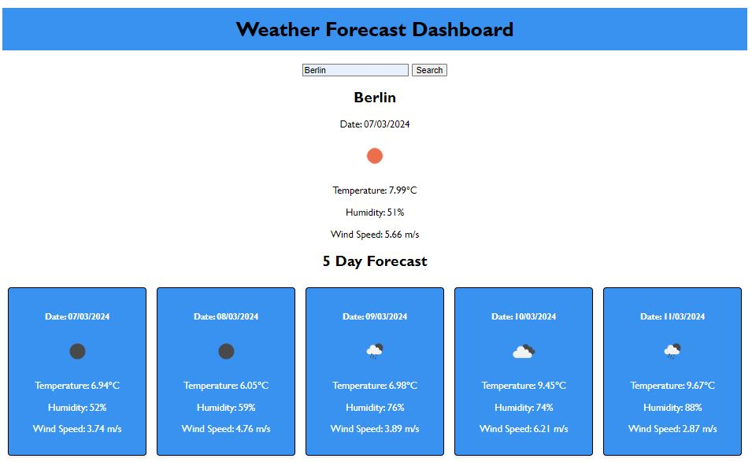
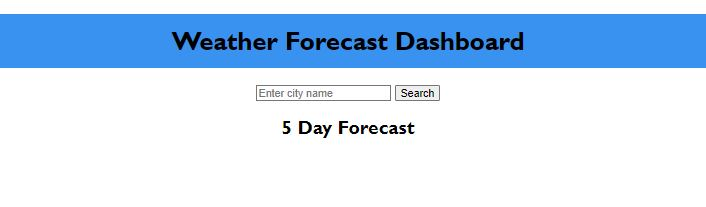

# weatherdashboardapp

## Description

In this project I created a Weather Dashboard App that tells the weather forecast in an city, Create a weather dashboard with form inputs. When a user searches for a city they are then presented with the current and the future conditions for that city for the next 5 days and that city is added to the search history. and opens as a tab, when the user hover over the search tab. The history is also stored locally and shown on the page below the new search, when the user types in another city. The results show the user user is shown the city's name, the date, an icon representation of what the weather conditions are, temperature, humidity and the wind speed.

## Table of Contents 

- [Usage](#usage)
- [Collaborators](#collaborators)
- [Technologies](#technologies)
- [APIs](#apis)
- [License](#license)

## Usage

#### Access the application on: - 

[Link to deployed page](https://rosebenson.github.io/weatherdashboardapp/)

#### The following images show the application's appearance and functionality:

